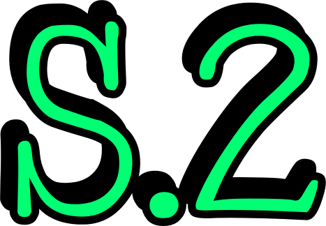

# SpriteScout

[](https://github.com/E1GAT0-dotcom/SpriteScout/actions/workflows/build.yml)
[](https://github.com/E1GAT0-dotcom/SpriteScout/releases/latest)

I kept sharing games that nobody could find, so I made this to see whether my
Scratch projects and studios actually show up in Scratch search, and what it
would take to rank higher.

It only reads public data through Scratch's API. It never logs in, never posts,
and never changes anything on Scratch.

Not affiliated with Scratch, the Scratch Foundation or MIT.

## Download

There are two versions on the
[releases page](https://github.com/E1GAT0-dotcom/SpriteScout/releases), and they
do the same checks. Pick one:

| System | GUI version | Text version |
|---|---|---|
| Windows | `SpriteScout-gui-windows.exe` | `SpriteScout-windows.exe` |
| Mac (Apple Silicon) | `SpriteScout-gui-mac.zip` | `SpriteScout-mac` |
| Linux | `SpriteScout-gui-linux` | `SpriteScout-linux` |

The **GUI version** opens a page in your browser with tabs and buttons, and
no typing of commands. Nothing is uploaded: the page is served by the program on
your own computer, and closing it stops there.

The **text version** runs in a terminal and takes typed commands. It's smaller,
it's what the tests drive, and it's handy if you like the keyboard.

Neither is signed, so systems get suspicious about them:

- Windows sometimes blocks or warns about unsigned programs. If that happens,
  download the source and double-click `SpriteScout.bat`, which runs the same
  tool with Python.
- Mac: unzip it, then right-click the app the first time and choose Open.
- Linux: `chmod +x` it, then run it.

Any system with Python 3.8 or newer can skip the downloads:

```
python spritescout_gui.py    the GUI version
python spritescout.py        the text version
```

Type `help` in the text version to see every command and flag.

Once a day it asks GitHub whether a newer version is out: the text version says
so when it starts, and the GUI version puts a bar at the top of the page.
`--no-update-check` turns that off, as does the tickbox in Settings.

### What the GUI version has

Each tab is one of the checks, and results appear as they arrive:

- **Check** — a username, project or studio, colour-coded by how findable it
  is, or every project inside a studio
- **Search words** — where something ranks for words people type, and what
  would move it up
- **Try titles** — suggests titles it could reach the first screen with, or
  says how crowded the ones you're considering already are
- **Find studios** — studios about a topic that anyone can add projects to
- **Where it ranks** — the searches something already comes up for
- **History** — the chart page of every check you've run
- **Settings** — sort, how deep to look, what counts as the first screen, how
  many projects to check at most, whether to include studios, and whether to
  mention new versions

**Keep looking** appears on anything the check stopped short of, and carries on
to the end of search. **Stop** ends a long check without losing the rows that
are already there.

## What it looks like

Checking my own account:

```
Checking 6 shared projects by E1GAT0_, looking through up to 200 search results each.

  [1/6] Not in search yet    -       The Boring Legal Machine V2
  [2/6] Easy to find         #1      E1GAT0_'s suggestion box
  [3/6] Not in search yet    -       Fish Clicker V1
  [4/6] Easy to find         #1      Ice Drifter v4 FASTER AND COMPRESSED
  [5/6] Easy to find         #3      Once upon a time there was a lovely princess. But…
  [6/6] Easy to find         #1      Fishtale - Chapter One

Summary for E1GAT0_
  Easy to find         4
  Not in search yet    2

Not in search yet
  Not in search, but shared in the last 14 days. New projects can take a while
  to show up, so check again in a few days.
    The Boring Legal Machine V2  https://scratch.mit.edu/projects/1256400969/
    Fish Clicker V1  https://scratch.mit.edu/projects/1380420363/
```

`--suggest` looks for a title it could actually be found by. This project was
past result 200 for its own name:

```
  Now: "Clock"
    Not on the first screen. 40+ projects match, and the first screen starts
    at 350 loves. This one has 2 loves.

  Titles it could be on the first screen for, busiest search first:

  1. "Clock Simulator"
     40+ projects match, and the first screen starts at 2 loves. This one has
     2 loves.
```

Adding words checks a search people would actually type, and says what would
help:

```
  Popular, the default sort: #46
    First screen: 9,994-142,712 loves, 1-4 word titles, shared since 2016-03-26

  Ways to rank higher
  - Keep the title short. In Popular, a short title that matches the search
    often beats projects with far more loves. This one has 6 words, and titles
    on the first screen have about 2.
```

## Using it

What follows is the text version, where you type things. The GUI version has all
of it as tabs and buttons instead.

Give it a username, a project or a studio:

```
griffpatch                    every shared project, plus the studios they host
scratch.mit.edu/projects/123456789/   one project, searched by its title
studio 12345                  one studio, searched by its title
123456789 pizza tycoon        where a project ranks when people search that
```

Every project or studio comes back as one of these:

| Result | What it means |
|---|---|
| Easy to find | In the first 16 results, which is all most people look at |
| Buried | In search, but further down |
| Not in search yet | Shared in the last 14 days, so search hasn't caught up |
| Missing from search | Search listed every match for the title and it wasn't there |
| Not in top N | So many things match the title that the check stopped |

There's more, but only if you ask for it:

| Flag | What it does |
|---|---|
| `--find-studios WORDS` | Active studios about WORDS that anyone can add projects to |
| `--suggest` | Titles it could reach the first screen with, busiest search first |
| `--titles "A" "B"` | Compares titles you're thinking about before you rename |
| `--find-words` | Lists searches your project already comes up for |
| `--contents` | Checks every project in a studio (a tickbox in the GUI version) |
| `--history` | A page with charts of your ranks over time |
| `--scan` | Keeps looking past where a check normally stops (press q to stop) |

Results go in the `output` folder: `search_log.csv` keeps every check, so later
checks tell you what moved, and `search_history.html` is the chart page.

## What I found out about Scratch search

The tips it gives come from measuring real search results, not guessing:

- Every word someone types has to be in the title. Words in the instructions
  almost never match, and usernames never do.
- Popular, the default sort, isn't only about loves. A short title that matches
  the search often beats a project with twice the loves: when that happened, the
  winner had the shorter title 87-95% of the time. Studios work the same way
  with followers, where shorter titles won 96% of those pairs.
- Trending is mostly about being new. Its first screen was nearly all projects
  shared in the last few weeks, some with only a handful of loves. For studios
  it's recent activity, like projects being added.
- Some words find nothing at all. "horror", "scary" and "fnaf" return zero
  results, for projects and studios.
- Search pages aren't reliable. When results tie, some show up twice and others
  get skipped, so SpriteScout looks again with the page breaks moved before it
  says anything is missing.
- No single common word is within reach. Every one-word search I measured —
  game, simulator, clicker, tycoon, obby, idle and thirty more — has a first
  screen held by projects with hundreds or thousands of loves. The cheapest,
  "idle", still needs 128. Pairing a word of your own with one people search is
  what gets you on the first screen, which is what `--suggest` looks for.
- Search stops at 10,000 results. Past that, nobody can reach you by scrolling.

## Helping out

Telling me what it got wrong about your own projects is the most useful thing
there is. [CONTRIBUTING.md](CONTRIBUTING.md) says what to include, and how to
run the tests if you want to change the code.

## Tests

```
python tests/run_tests.py            offline checks, then every command against Scratch
python tests/run_tests.py --offline  only the checks that don't need the internet
python tests/run_tests.py --exe      also try the main commands with SpriteScout.exe
```

Everything the tests make lands in `output/test-run`, and `report.txt` there has
every command with its full output.

## Building it yourself

```
pip install pyinstaller
pyinstaller --onefile --console --name SpriteScout spritescout.py
pyinstaller --onefile --windowed --name SpriteScout --add-data "gui.html;." --add-data "icon.png;." spritescout_gui.py
```

On Mac and Linux the `--add-data` separator is `:` instead of `;`. GitHub builds
all six downloads on every release; see
[.github/workflows/build.yml](.github/workflows/build.yml).

Nothing to install: `spritescout.py` is the whole tool, and
`spritescout_gui.py` serves `gui.html` on top of it. Standard library only.
